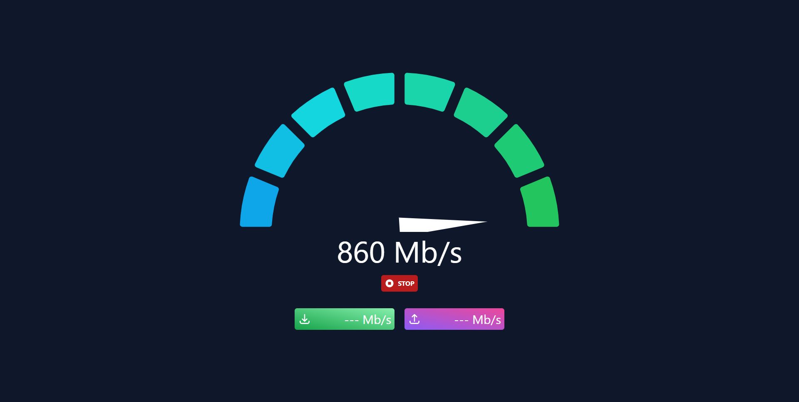
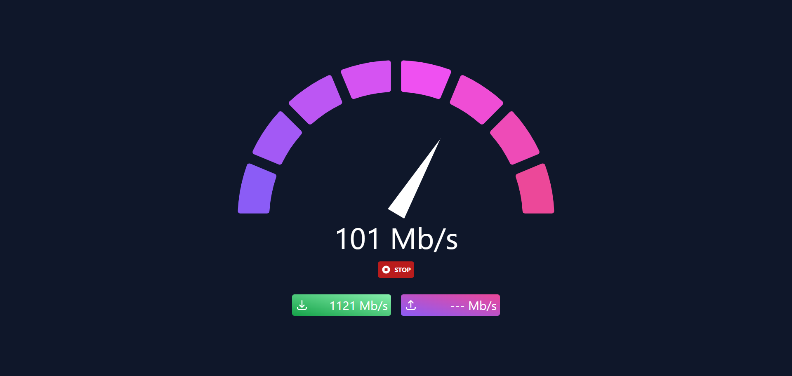
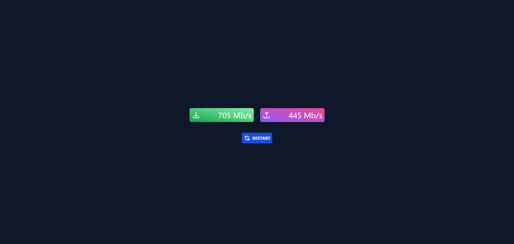
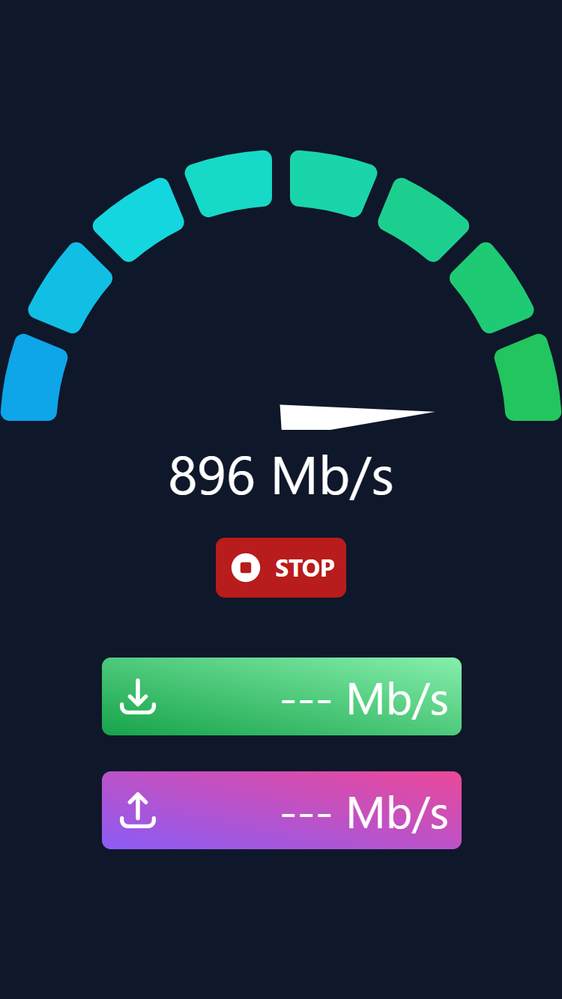
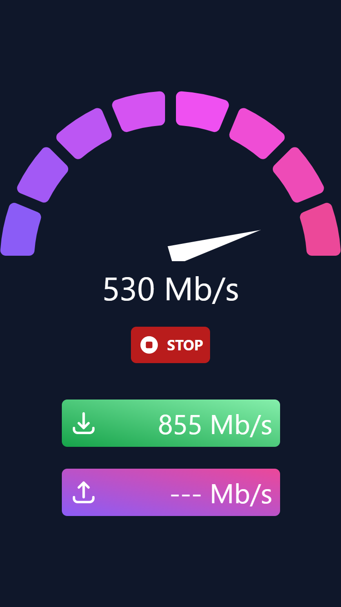
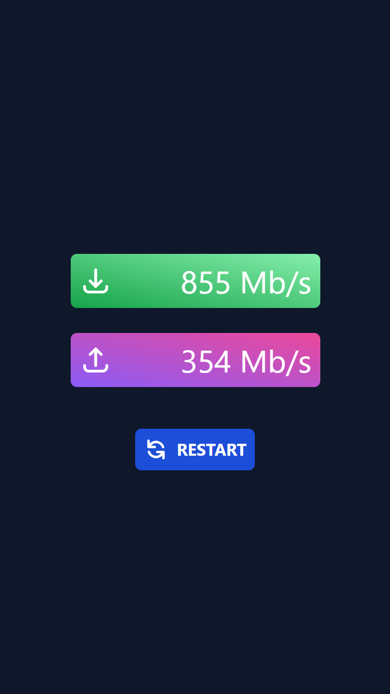

# SpeedTest

Simple speedtest application which measures both download speed and upload speed.
Under the hood it uses websockets to upload and download chunks of data. Response times are measured to than calculate total bandwidth.
Speedtest is automatically run when visiting website.

## 🔧 Technologies

## Screenshots

### Desktop

Download Test

Upload test

Results screen

### Mobile

Download Test

Upload test

Results screen

## Setup

1. Clone this repository
2. In app directory create .env-local with NEXT_PUBLIC_BACKEND_URL variable that points to backend server
3. Install packages with preferentially yarn
4. In server directory create .env file with PORT and FRONTEND_URL variables
5. Install server packages
6. For both server and app directories run first build script and then start script
